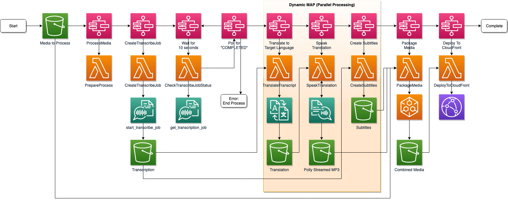

# Create multi-language audio and caption tracks for Video On Demand (VOD) assets using AWS AI and Media Services
  
This sample project includes a CloudFormation template which deploys a demo architecture leveraging AWS AI and Media Services to create multi-language audio and caption tracks for Video On Demand (VOD) assets. This sample code is functional for us-east-1 region only.
  
AWS resources and automation workflow are created by running the provided CloudFormation template.
  
Below is a diagram showing the workflow for this sample project.

  
# Requirements
  
### AWS Account
  
You'll need an AWS Account and permission to create resources in:
* AWS CloudFormation
* AWS IAM
* Amazon S3
* Amazon CloudFront
* AWS Step Functions
* AWS Lambda
* Amazon API Gateway
* Amazon DynamoDB
* AWS System Manager Parameter Store
  
### Cost
  
AWS Elemental MediaConvert jobs will incur charges. See: https://aws.amazon.com/mediaconvert/pricing.
  
The following services are part of the AWS Free Tier. See the [AWS Free Tier page](https://aws.amazon.com/free) for details:
* Amazon S3 
* Amazon Transcribe
* Amazon Translate
* Amazon Polly
* Amazon CloudFront
* Amazon CloudWatch
  
### Source video (mp4 format)
  
You will need to have an .mp4 video to upload to AWS.  The video must be in .mp4 format.
  
**MediaConvert job produces HLS M3U8 playlist output with the following characteristics:**
* Captions: WebVTT
* Outputs: 1920x1080, 1080x720, 640x360
* Video Codec: H_264
* Audio Codec: AAC
  
### Video player
  
The final .m3u8 video can be played directly in the supplied front-end web application or in the video player of your choice.  You may want to also check out https://hls-js.netlify.app/demo/.
  
# Let's get started!
  
  
## Download this project and prepare the CloudFormation template
A CloudFormation [template](cloudformation/cloudformation.yaml) is provided in this repo but requires some preparation -- prior to running CloudFormation, Lambda layers containing binaries must be created and Lambda zip files must be uploaded to an S3 bucket in your AWS account. 
    
Follow these [CloudFormation template preparation steps](cloudformation/README.md)
    
  
## Run the CloudFormation template
**1.** Log into your AWS account and access CloudFormation in the AWS Console.  Click **Create Stack** (with new resources).
 
**2.** Select **Template is Ready**, **Upload a template file**, and click **Choose File**.  Browse to the **cloudformation.yaml** file from this project and upload it.  Click **Next**.

**3.** Fill in values for **S3CodeBucket** parameter and click **Next**.

**4.** Take all defaults and check the box to acknowledge that AWS CloudFormation might create IAM resources with custom names.  Click **Create stack** to launch the stack.
  
Resources will be ready to use in approx. 5-10 minutes.
    
Perform these post-deployment steps to configure the front-end application:  
* On your local system, use your favorite editor to open **front-end/scripts.js** file. 
* In the [CloudFormation Console](https://console.aws.amazon.com/cloudformation), click the **stvblog** stack and click **Outputs**. 
* Copy the values for **HttpApiUrl** and **S3UploadBucketName** and insert them into the **scripts.js** file. Save your changes.
* In the CloudFormation stack **Outputs**, make note of the bucket name value associated with **S3AppBucketName**. Navigate to the [AWS S3 Console](https://s3.console.aws.amazon.com/s3/) and click to the open that bucket.
* Upload the 4 files from the local front-end folder to the top level of the bucket. 
  
## Access the web application and upload source video
  
**1.** In the [CloudFormation Console](https://console.aws.amazon.com/cloudformation), click the **stvblog** stack name and click **Outputs**. Click the **FrontendUrl**. This will launch the web application. 
  
**2.** Use the web form to upload the source video file and choose the desired languages for caption and/or audio tracks.
  
**3.** Click **Refresh Job** to see the job status. Note: jobs will take a minimum of 20 minutes to complete and may run longer. 
  
**4.** When the final video is ready for viewing, a link to the video will appear in next to the job.
  
  
# Limitations and Assumptions
  
- Uploaded video must be in .mp4 format for compatibility with the Amazon Transcribe service. Transcribe accuracy depends on the audio quality.
- This sample code is functional for us-east-1 region only.
- Lambda functions created for this workload are for reference only.
- When this CloudFormation stack is deleted, the S3 buckets and DynamoDB table used in this workflow will be preserved.  If you no longer want these resources, you must delete them manually.
  
    
# Security

See [CONTRIBUTING](CONTRIBUTING.md#security-issue-notifications) for more information.
  
# License

This library is licensed under the MIT-0 License. See the LICENSE file.
  
# Contributors
  
Rob Dachowski, AWS Solutions Architect Manager, robdac@amazon.com  
Katreena Mullican, AWS Sr Solutions Architect, mullicak@amazon.com  
Matt Juliana, AWS Sr Partner Solutions Architect, mattjul@amazon.com  

